## 头条推荐系统

### 1. 基础介绍

#### 1.1 系统架构

下图是本项目所涉及的架构工具：


下图展示了项目具体的开发流程：


**基础数据层**：

- 用户行为日志采集 ==> 获取用户的行为特征

- 业务数据库 ==> 包含用户数据和文章数据，用户数据是APP中注册用户的基础数据，文章数据是在媒体平台上的文章的基本信息

- 分布式文件系统 ==> 存储海量的用户日志信息，用于后续计算
- 日志数据实时流向Kafka用于实时计算

**数据处理层**：

- 基础计算：基于离线和实时数据，对各类基础数据计算成用户画像、文章画像
- 召回和排序
	- **召回环节使用各种算法逻辑从海量的文章中筛选出用户感兴趣的文章候选集合，集合大小：上千级别。排序即对候选集合中的文章进行用户相对的模型结果排序，生成一个排序列表。**
	- 召回
	- 排序
		- 点击率预估模型
		- 特征处理、模型评价


#### 1.2 开发环境

- 虚拟机环境

	- 单机环境
		- hadoop、HBase、hive、spark

- python环境

	- anaconda环境

		- [具体配置](https://www.cnblogs.com/haoyiyang/p/11309701.html)

		- [本次项目采用Anaconda3-5.3.0-Linux-x86_64.sh](https://repo.anaconda.com/archive/Anaconda3-5.3.0-Linux-x86_64.sh)

		- ```conf
			//创建虚拟环境
			conda create -n reco_sys python==3.7.0
			//查看虚拟环境
			conda env list
			//查看安装包
			conda list
			//进入虚拟环境
			source activate reco_sys
			
			```

		- 创建项目文件并与本机Pycharm关联


### 2. 离线计算并更新文章画像

#### 2.1 离线画像流程

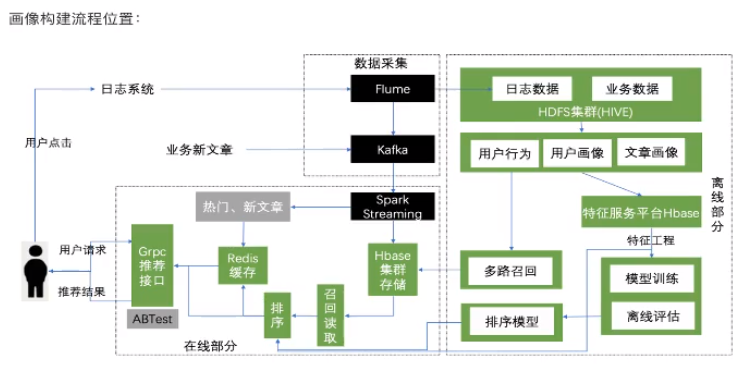

#### 2.2 Sqoop数据迁移

Sqoop数据迁移主要有两种方式：

- mysql ==> hdfs ==> hive
- mysql ==> hive

重点是增量更新：

- append
- lastmodified
	- 时间列
	- 合并的ID

使用crontab-shell脚本进行定时数据迁移：


==**本质是结合数据字段业务编写shell脚本，重点在于Shell和SQL基础。**==


#### 2.3 Flume用户日志收集

**埋点设计是推荐系统的基础。**

常见的埋点设计有：点击事件、浏览时间、收藏事件、分享事件等；同时根据可选的推荐算法，进行推荐频道更新，还有一个推荐算法的转化率分析。

埋点存储格式一般为json。


**收集步骤：**

- 创建Hive对应日志收集表
- flume收集日志配置
- 开启收集命令

- 流程：原始日志文件 ==> flume ==> hdfs ==> hive

注意在创建Hive表时：

- 需要分区，防止影响性能
- 关联HDFS路径


#### 2.4 离线文章画像计算

**学习目标**：

- 目标
	- 了解文章画像的构成
	- 知道spark Tfidf以及TextRank计算工具的使用
	- 知道文章画像的计算和构建
- 应用
	- 应用spark完成文章Tfidf值计算
	- 应用spark完成文章TextRank值计算
	- 应用spark完成文章画像结果值计算与存储


**离线文章画像组成需求**：

- 文章画像：给文章定义一些词，主要包括主题词和关键词。
	- 关键词：文章中一些词的权重较高。例如，TextRank计算出的结果TopK个词及权重。
	- 主题词：在关键词基础之上进行进一步的规范化。例如，TextRank的TopK与Tfidf的TopK的交集。

- 步骤：

	- 原始文章表数据合并得到文章所有词语句信息
		- 文章标题表+文章频道名称表+文章内容表 ==> 文章完整内容

	- 所有历史文章Tfidf计算
	- 所有历史文章TextRank计算


**原始文章数据的合并**：

- 初始化spark信息配置，定义一个基类
- 合并三张表内容，到一张表，并写入到Hive中
- 技术要点：使用spark sql进行Hive中数据的读取合并，并写入到Hive中


**Tfidf计算**

- 一种用于信息检索和数据挖掘的常用加权技术
- Tfidf包括tf和idf
	- tf表示词频，表达式为$TF(t,d)$，表示单词$t$在文档$d$中出现的频率
	- idf表示逆文本频率指数，表达式为$IDF(t)$,表示单词$t$对于表达语义所起的重要程度
		- $IDF=log{\frac{文章总数}{包含单词t的文章总数+1}}$
		- 直观的解释是：如果一个单词在多个文章中出现，那么他可能是一个比较同意的词汇，对于区分文章的特定语义贡献度较小
	- $TF-IDF(t,d)=TF(t,d)*IDF(t)$

- Tfidf的训练步骤
	- 读取N篇文章数据
	- 文章数据进行分词处理，这里采用jieba分词，并采用自建的字典和停用词。
	- 将分词结果转化为DF（Spark SQL的基础数据结构）
	- 利用Spark ML的包进行TFIDF计算（具体代码细节，参见：[MLlib Main Guide](http://spark.apache.org/docs/latest/ml-features.html#tf-idf)）


**TextRank计算**

- 借鉴了[PageRank算法](https://www.jianshu.com/p/ffaee5708866)
	- $S(v_i)=(1-d)+d*\sum\limits_{j\in In(V_i)} \frac{1}{|Out(V_j)|}S(V_j)$

- PageRank实际上是一个比较通用的算法，对于文本来说，只要能够构造出一个图，图中的结点是单词or句子，通过某种方法定义这些结点存在某种关系，那么就可以使用PageRank算法，得到一篇文章中的关键词or摘要。
- 文章关键词计算：利用投票原理，每个单词的几个邻居都会投票，根据票数来计算权重，从而得到关键词；例如：[TextRank算法提取关键词的Java实现](https://www.hankcs.com/nlp/textrank-algorithm-to-extract-the-keywords-java-implementation.html)

- 文章摘要计算：计算句子的相似度来构建图的邻接矩阵；例如：[TextRank学习笔记](https://www.jianshu.com/p/ffaee5708866)
- TextRank计算步骤（本项目）
	- 读取N篇文章数据
	- 文章数据进行分词处理，这里采用jieba分词，并采用自建的字典和停用词。
	- 调用jieba分词的TextRank将结果写入到DF，并最终写入到Hive中去


**文章画像计算**

- 步骤
	- 加载Tfidf和TextRank结果，保留关键字以及计算权重
	- 合并关键词权重到字典结果作为关键词（Tfidf和TextRank的结果进行相加）
	- 将Tfidf和TextRank共现的词作为主题词
	- 将主题词和关键词表进行合并，插入表

**本质上就是一些列SQL操作，表的合并，筛选等操作**


#### 2.5 离线文章画像更新

TF-IDF和TextRank的计算与2.4中一致，加入了定时获取一小时（自定义）内的文章信息功能。这一小时内的文章的画像信息存入Hive中。


#### 2.6 文章相似度计算

- 需求
	- 首页频道推荐：每个频道推荐的时候，会通过计算两两文章相似度，快速达到在线推荐的效果，比如用户点击文章，我们可以将离线计算好相似度的文章排序快速推荐给该用户。此方式也就可以解决冷启动的问题
- 方式
	- 计算两两文章的TF-IDF之间的相似度
	- 计算两两文章的word2vec或者doc2vec向量相似度

这里我们选择计算两两文章之间的word2vec向量相似度。

计算文章之间的相似度，首先需要计算文章中每个关键词的词向量，利用每个关键词的词向量得到文章的词向量，然后利用文章的词向量来计算文章的相似度。

- 文章词向量计算

	- 通过大量历史文章数据，训练词的词向量。由于数据过大，采用分频道进行词向量训练。频道列表如下：

		- ```python
			channel_info = {
			            1: "html",
			            2: "开发者资讯",
			            3: "ios",
			            4: "c++",
			            5: "android",
			            6: "css",
			            7: "数据库",
			            8: "区块链",
			            9: "go",
			            10: "产品",
			            11: "后端",
			            12: "linux",
			            13: "人工智能",
			            14: "php",
			            15: "javascript",
			            16: "架构",
			            17: "前端",
			            18: "python",
			            19: "java",
			            20: "算法",
			            21: "面试",
			            22: "科技动态",
			            23: "js",
			            24: "设计",
			            25: "数码产品",
			        }
			```

	- 选取18号频道进行训练，首先是读取文章并分词

		- ```python
			spark.sql("use article")
			article_data = spark.sql("select * from article_data where channel_id=18")
			words_df = article_data.rdd.mapPartitions(segmentation).toDF(['article_id', 'channel_id', 'words'])
			
			def segmentation(partition):
			    import os
			    import re
			    import jieba
			    import jieba.analyse
			    import jieba.posseg as pseg
			    import codecs
			
			    abspath = "/root/words"
			
			    # 结巴加载用户词典
			    userDict_path = os.path.join(abspath, "ITKeywords.txt")
			    jieba.load_userdict(userDict_path)
			
			    # 停用词文本
			    stopwords_path = os.path.join(abspath, "stopwords.txt")
			
			    def get_stopwords_list():
			        """返回stopwords列表"""
			        stopwords_list = [i.strip() for i in codecs.open(stopwords_path).readlines()]
			        return stopwords_list
			
			    # 所有的停用词列表
			    stopwords_list = get_stopwords_list()
			
			    # 分词
			    def cut_sentence(sentence):
			        """对切割之后的词语进行过滤，去除停用词，保留名词，英文和自定义词库中的词，长度大于2的词"""
			        # eg:[pair('今天', 't'), pair('有', 'd'), pair('雾', 'n'), pair('霾', 'g')]
			        seg_list = pseg.lcut(sentence)
			        seg_list = [i for i in seg_list if i.flag not in stopwords_list]
			        filtered_words_list = []
			        for seg in seg_list:
			            if len(seg.word) <= 1:
			                continue
			            elif seg.flag == "eng":
			                if len(seg.word) <= 2:
			                    continue
			                else:
			                    filtered_words_list.append(seg.word)
			            elif seg.flag.startswith("n"):
			                filtered_words_list.append(seg.word)
			            elif seg.flag in ["x", "eng"]:  # 是自定一个词语或者是英文单词
			                filtered_words_list.append(seg.word)
			        return filtered_words_list
			
			    for row in partition:
			        sentence = re.sub("<.*?>", "", row.sentence)    # 替换掉标签数据
			        words = cut_sentence(sentence)
			        yield row.article_id, row.channel_id, words
			```

		- ` word_df`结果如下所示，words为分词后的词语列表

			

	
	- 使用分词后的所有词语，对 Word2Vec 模型进行训练并将模型保存到 HDFS，其中 vectorSize 为词向量的长度，minCount 为词语的最小出现次数，windowSize 为训练窗口的大小，inputCol 为输入的列名，outputCol 为输出的列名。

		- ```python
			from pyspark.ml.feature import Word2Vec
			
			w2v_model = Word2Vec(vectorSize=100, inputCol='words', outputCol='vector', minCount=3)
			model = w2v_model.fit(words_df)
			model.save("hdfs://hadoop-master:9000/headlines/models/word2vec_model/channel_18_python.word2vec")
			```

		- 加载训练好的模型

			```python 
			from pyspark.ml.feature import Word2VecModel
			
			w2v_model = Word2VecModel.load("hdfs://hadoop-master:9000/headlines/models/word2vec_model/channel_18_python.word2vec")
			vectors = w2v_model.getVectors()
			```

		- `vectors`结果如下所示，其中 vector 是训练后的每个词的 100 维词向量，是 vector 类型格式的，如 [0.2 -0.05 -0.1 ...]

			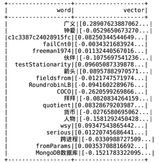

			

	- 计算出了所有词语的词向量，接下来，还要得到关键词的词向量，因为我们需要通过关键词的词向量来计算文章的词向量。

		- 首先通过读取频道内的文章画像来得到关键词（实际场景应该只读取新增文章画像）, 读取频道的文章画像

			```python
			article_profile = spark.sql("select * from article_profile where channel_id=18")
			```

		- 在文章画像表中，关键词和权重是存储在同一列的，我们可以利用 `LATERAL VIEW explode() AS` 方法，将 map 类型的 keywords 列中的关键词和权重转换成单独的两列数据

			```python
			article_profile.registerTempTable('profile')
			keyword_weight = spark.sql("select article_id, channel_id, keyword, weight from profile LATERAL VIEW explode(keywords) AS keyword, weight")
			```

		- `keyword_weight` 结果如下所示，keyword 为关键词，weight 为对应的权重

			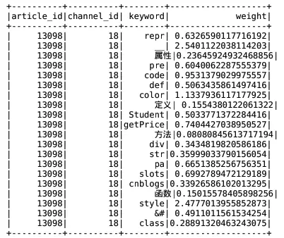

		- 利用关键词 keyword 列，将文章关键词 `keyword_weight` 与词向量结果 `vectors` 进行内连接，从而得到每个关键词的词向量.

			```python
			keyword_vector = keyword_weight.join(vectors, vectors.word==keyword_weight.keyword, 'innner')
			```

		- `keywords_vector` 结果如下所示，vector 即对应关键词的 100 维词向量

			

	- 将文章每个关键词的词向量加入权重信息，并计算关键词词向量的平均值得到文章的词向量。

		- 采用每个关键词的词向量 = 关键词的权重 x 关键词的词向量，即 weight_vector = weight * vector​，注意这里的 `vector` 为 vector 类型，所以 weight * vector 是权重和向量的每个元素相乘，向量的长度保持不变。

			```python
			def compute_vector(row):
			    return row.article_id, row.channel_id, row.keyword, row.weight*row.vector
			
			article_keyword_vectors = keywords_vector.rdd.map(compute_vector).toDF(['article_id', 'channel_id', 'keyword', 'weightingVector'])
			```

		- `article_keyword_vectors` 结果如下所示，weightingVector 即为加入权重信息后的关键词的词向量

			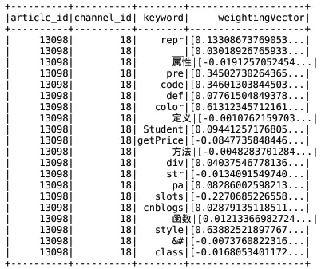

		- 将上面的结果按照 article_id 进行分组，利用 `collect_set()` 方法，将一篇文章内所有关键词的词向量合并为一个列表。

			```python
			article_keyword_vectors.registerTempTable('temptable')
			article_keyword_vectors = spark.sql("select article_id, min(channel_id) channel_id, collect_set(weightingVector) vectors from temptable group by article_id")
			```

		- `article_keyword_vectors` 结果如下所示，vectors 即为文章内所有关键词向量的列表，如 [[0.6 0.2 ...], [0.1 -0.07 ...], ...]

			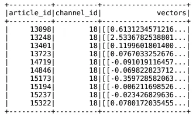

		- 计算每篇文章内所有关键词的词向量的平均值，作为文章的词向量。注意，这里的 `vectors` 是包含多个词向量的列表，词向量列表的平均值等于其中每个词向量的对应元素相加再除以词向量的个数。

			```python
			def compute_avg_vectors(row):
			    x = 0
			    for i in row.vectors:
			        x += i
			    # 求平均值
			    return row.article_id, row.channel_id, x / len(row.vectors)
			
			article_vector = article_keyword_vectors.rdd.map(compute_avg_vectors).toDF(['article_id', 'channel_id', 'vector'])
			```

		- `article_vector` 结果如下所示

			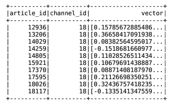

		- `article_vector` 中的 `vector` 列还是 vector 类型，而 Hive 不支持该数据类型，所以需要将 vector 类型转成 array 类型（list）。

			```python 
			def to_list(row):
			    return row.article_id, row.channel_id, [float(i) for i in row.vector.toArray()]
			
			article_vector = article_vector.rdd.map(to_list).toDF(['article_id', 'channel_id', 'vector'])
			```

		- 在Hive中创建文章词向量表article_vector

			```python
			CREATE TABLE article_vector
			(
			    article_id INT comment "article_id",
			    channel_id INT comment "channel_id",
			    articlevector ARRAY<DOUBLE> comment "keyword"
			);
			```

		- 最后将18频道内的所有文章的词向量存储到Hive的文章词向量表article_vector中

			```python
			article_vector.write.insertInto("article_vector")
			```

- 文章相似度计算

	前面我们计算出了文章的词向量，接下来就可以根据文章的词向量来计算文章的相似度了。通常我们会有几百万、几千万甚至上亿规模的文章数据，为了优化计算性能，我们可以只计算每个频道内文章之间的相似度，因为通常只有相同频道的文章关联性较高，而不同频道之间的文章通常关联性较低。在每个频道内，我们还可以用聚类或局部敏感哈希对文章进行分桶，将文章相似度的计算限制在更小的范围，只计算相同分类内或相同桶内的文章相似度。

	- [minHash（最小Hash）和LSH（局部敏感Hash）](https://blog.csdn.net/liujan511536/article/details/47729721)

		- 最小Hash是用来简化Jaccard相似度计算的，因为可以证明，对于两个集合其最小哈希值相似的概率等这两个集合的相似度；而最小哈希相似概率可以通过签名矩阵，采用线性计算方式直接得到，从而得到了两个集合的相似度。[Hash本质上就是数据降维](https://www.cnblogs.com/CSLaker/p/9720561.html)。
		- 局部敏感Hash是基于两个相似度高的集合在经过Hash计算之后依旧相似度较高的假设，在LSH中采用“是否在一个桶内”来表示相似度的高低。这样可以在进行minHash之前，降低需要计算的签名矩阵的复杂度，从而进一步降低计算量。
		- 基于上述原理，Spark ML中实现了minHashLSH函数。

	- 读取数据进行训练

		- 首先，读取 18 号频道内所有文章的 ID 和词向量作为训练集。

			```python
			article_vector = spark.sql("select article_id, articlevector from article_vector where channel_id=18")
			train = article_vector.select(['article_id', 'articlevector'])
			```

		- 文章词向量表中的词向量是被存储为 array 类型的，我们利用 Spark 的 `Vectors.dense()` 方法，将 array 类型（list）转为 vector 类型.

			```python
			from pyspark.ml.linalg import Vectors
			
			def list_to_vector(row):
			    return row.article_id, Vectors.dense(row.articlevector)
			
			train = train.rdd.map(list_to_vector).toDF(['article_id', 'articlevector'])
			```

	- 使用训练集 `train` 对 Spark 的 `BucketedRandomProjectionLSH` 模型进行训练，其中 inputCol 为输入特征列，outputCol 为输出特征列，numHashTables 为哈希表数量，bucketLength 为桶的数量，数量越多，相同数据进入到同一个桶的概率就越高。

		```python
		from pyspark.ml.feature import BucketedRandomProjectionLSH
		
		brp = BucketedRandomProjectionLSH(inputCol='articlevector', outputCol='hashes', numHashTables=4.0, bucketLength=10.0)
		model = brp.fit(train)
		```

		- 训练好模型后，调用 `approxSimilarityJoin()` 方法即可计算数据之间的相似度，如 `model.approxSimilarityJoin(df1, df2, 2.0, distCol='EuclideanDistance')` 就是利用欧几里得距离作为相似度，计算在 df1 与 df2 每条数据的相似度，这里我们计算训练集中所有文章之间的相似度。

			```python
			similar = model.approxSimilarityJoin(train, train, 2.0, distCol='EuclideanDistance')
			```

		- `similar` 结果如下所示，EuclideanDistance 就是两篇文章的欧几里得距离，即相似度

			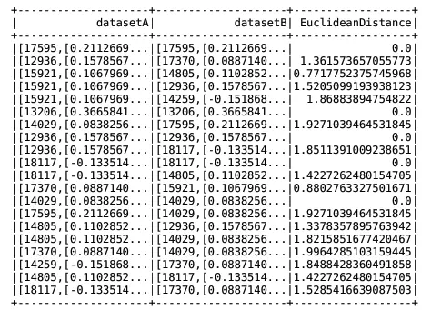

	- 存储文章相似度数据到HBase中

		- 首先创建文章相似度表。

			```python
			create 'article_similar', 'similar'
			```

		- 存储文章相似度结果

			```python
			def save_hbase(partition):
			    import happybase
			    pool = happybase.ConnectionPool(size=3, host='hadoop-master')
			
			    with pool.connection() as conn:
			        # 建立表连接
			        table = conn.table('article_similar')
			        for row in partition:
			            if row.datasetA.article_id != row.datasetB.article_id:
			                table.put(str(row.datasetA.article_id).encode(), {"similar:{}".format(row.datasetB.article_id).encode(): b'%0.4f' % (row.EuclideanDistance)})
			                
			        # 手动关闭所有的连接
			        conn.close()
			
			similar.foreachPartition(save_hbase) 
			```


### 3. 离线计算用户画像

前面我们完成了文章画像的构建以及文章相似度的计算，接下来，我们就要实现用户画像的构建了。用户画像往往是大型网站的重要模块，基于用户画像不仅可以实现个性化推荐，还可以实现用户分群、精准推送、精准营销以及用户行为预测、商业化转化分析等，为商业决策提供数据支持。通常用户画像包括用户属性信息（性别、年龄、出生日期等）、用户行为信息（浏览、收藏、点赞等）以及环境信息（时间、地理位置等）

#### 3.1 处理用户行为数据

- 读取flume收集用户行为数据到Hive中的user_action表

	- **读取之前关联分区**

		```python
		_day = time.strftime("%Y-%m-%d", time.localtime())
		_localtions = '/user/hive/warehouse/profile.db/user_action/' + _day
		
		fs = pyhdfs.HdfsClient(hosts='hadoop-master:50070')
		if fs.exists(_location):
		 # 如果有该文件直接关联，捕获关联重复异常
		    try:
		        self.spark.sql("alter table user_action add partition (dt='%s') location '%s'" % (_day, _localions))
		    except Exception as e:
		        pass
		
		    self.spark.sql("use profile")
		    user_action = self.spark.sql("select actionTime, readTime, channelId, param.articleId, param.algorithmCombine, param.action, param.userId from user_action where dt>=" + _day)
		```

	- `user_action` 结果如下所示

		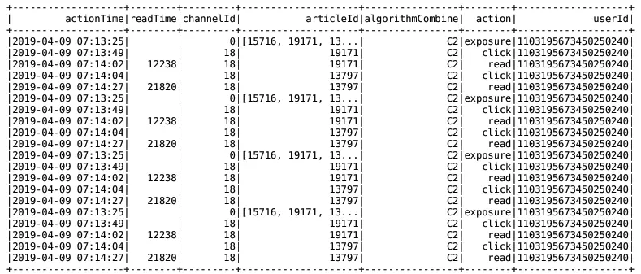

- 构建 user_article_basic，这张表包括了用户 ID、文章 ID、是否曝光、是否点击、阅读时间等等。

	- 创建user_article_basic

		```python
		create table user_article_basic
		(
			user_id     BIGINT comment "userID",
		    action_time STRING comment "user actions time",
		    article_id  BIGINT comment "articleid",
		    channel_id  INT comment "channel_id",
		    shared      BOOLEAN comment "is shared",
		    clicked     BOOLEAN comment "is clicked",
		    collected   BOOLEAN comment "is collected",
		    exposure    BOOLEAN comment "is exposured",
		    read_time   STRING comment "reading time"
		)
			COMMENT "user_article_basic"
		    CLUSTERED by (user_id) into 2 buckets
		    STORED as textfile
		    LOCATION '/user/hive/warehouse/profile.db/user_article_basic';
		```

	- 遍历每一条原始用户行为数据，判断用户对文章的行为，在 user_action_basic 中将该用户与该文章对应的行为设置为 True.

		```python
		if user_action.collect():
		    def _generate(row):
		        _list = []
		        if row.action == 'exposure':
		            for article_id in eval(row.articleId):
		                # ["user_id", "action_time","article_id", "channel_id", "shared", "clicked", "collected", "exposure", "read_time"]
		                _list.append(
		                    [row.userId, row.actionTime, article_id, row.channelId, False, False, False, True, row.readTime])
		            return _list
		        else:
		            class Temp(object):
		                shared = False
		                clicked = False
		                collected = False
		                read_time = ""
		
		            _tp = Temp()
		            if row.action == 'click':
		                _tp.clicked = True
		            elif row.action == 'share':
		                _tp.shared = True
		            elif row.action == 'collect':
		                _tp.collected = True
		            elif row.action == 'read':
		                _tp.clicked = True
		
		            _list.append(
		                [row.userId, row.actionTime, int(row.articleId), row.channelId, _tp.shared, _tp.clicked, _tp.collected,
		                 True, row.readTime])
		            return _list
		
		    user_action_basic = user_action.rdd.flatMap(_generate)
		    user_action_basic = user_action_basic.toDF(
		        ["user_id", "action_time", "article_id", "channel_id", "shared", "clicked", "collected", "exposure",
		         "read_time"])
		```

	- `user_action_basic` 结果如下所示，这里的一条记录包括了某个用户对某篇文章的所有行为

		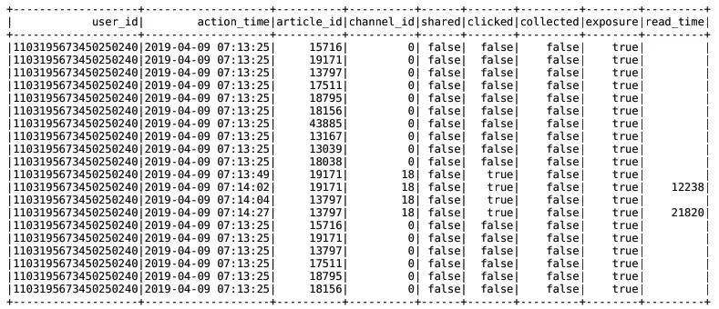

	- 由于 Hive 目前还不支持 pyspark 的原子性操作，所以 user_article_basic 表的用户行为数据只能全量更新（实际场景中可以选择其他语言或数据库实现）。这里，我们需要将当天的用户行为与 user_action_basic 的历史用户行为进行合并.

		```python
		old_data = uup.spark.sql("select * from user_article_basic")
		new_data = old_data.unionAll(user_action_basic)
		```

	- 合并后又会产生一个新的问题，那就是用户 ID 和文章 ID 可能重复，因为今天某个用户对某篇文章的记录可能在历史数据中也存在，而 `unionAll()` 方法并没有去重，这里我们可以按照用户 ID 和文章 ID 进行分组，利用 `max()` 方法得到 action_time, channel_id, shared, clicked, collected, exposure, read_time 即可，去重后直接存储到 user_article_basic 表中

		```python
		new_data.registerTempTable("temptable")
		
		self.spark.sql('''insert overwrite table user_article_basic select user_id, max(action_time) as action_time, 
		        article_id, max(channel_id) as channel_id, max(shared) as shared, max(clicked) as clicked, 
		        max(collected) as collected, max(exposure) as exposure, max(read_time) as read_time from temptable 
		        group by user_id, article_id''')
		```

	- 表 user_article_basic 结果如下所示

		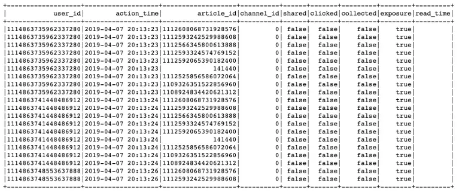


#### 3.2 计算用户画像

我们选择将用户画像存储在 Hbase 中，因为 Hbase 支持原子性操作和快速读取，并且 Hive 也可以通过创建外部表关联到 Hbase，进行离线分析，如果要删除 Hive 外部表的话，对 Hbase 也没有影响。所以数据存储在HBase中，采用Hive从HBase中读取数据进行分析。

-  Hbase 中创建用户画像表并关联到Hive中

	- 创建表

		```python
		create 'user_profile', 'basic','partial','env'
		```

	- 在 Hive 中创建 Hbase 外部表，注意字段类型设置为 map

		```sql
		create external table user_profile_hbase
		(
		    user_id         STRING comment "userID",
		    information     MAP<STRING, DOUBLE> comment "user basic information",
		    article_partial MAP<STRING, DOUBLE> comment "article partial",
		    env             MAP<STRING, INT> comment "user env"
		)
		    COMMENT "user profile table"
		    STORED BY 'org.apache.hadoop.hive.hbase.HBaseStorageHandler'
		        WITH SERDEPROPERTIES ("hbase.columns.mapping" = ":key,basic:,partial:,env:")
		    TBLPROPERTIES ("hbase.table.name" = "user_profile");
		```

	- 创建外部表之后，还需要导入一些依赖包

		```undefined
		cp -r /root/bigdata/hbase/lib/hbase-*.jar /root/bigdata/spark/jars/
		cp -r /root/bigdata/hive/lib/h*.jar /root/bigdata/spark/jars/
		```

	- 接下来，读取处理好的用户行为数据，由于日志中的 channel_id 有可能是来自于推荐频道（0），而不是文章真实的频道，所以这里要将 channel_id 列删除

		```rust
		spark.sql("use profile")
		user_article_basic = spark.sql("select * from user_article_basic").drop('channel_id')
		```

	- 通过文章 ID，将用户行为数据与文章画像数据进行连接，从而得到文章频道 ID 和文章主题词

		```csharp
		spark.sql('use article')
		article_topic = spark.sql("select article_id, channel_id, topics from article_profile")
		user_article_topic = user_article_basic.join(article_topic, how='left', on=['article_id'])
		```

	- `user_article_topic` 结果如下图所示，其中 topics 列即为文章主题词列表，如 ['补码', '字符串', '李白', ...]

		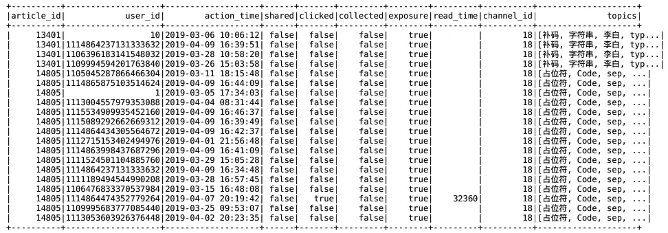

- 计算每个主题词对于用户的权重

	- 我们需要计算每一个主题词对于用户的权重，所以需要将 topics 列中的每个主题词都拆分为单独的一条记录。可以利用 Spark 的 `explode()` 方法，达到类似“爆炸”的效果

		```python 
		import pyspark.sql.functions as F
		
		user_article_topic = user_topic.withColumn('topic', F.explode('topics')).drop('topics')
		```

	- `user_article_topic` 如下图所示

		

		我们通过用户对哪些文章发生了行为以及该文章有哪些主题词，计算出了用户对哪些主题词发生了行为。这样，我们就可以根据用户对主题词的行为来计算主题词对用户的权重，并且将这些主题词作为用户的标签。同时还需考虑时间衰减，那么，用户标签权重的计算公式为：用户标签权重 =（用户行为分值之和）x 时间衰减。其中，时间衰减公式为：时间衰减系数 = 1 / (log(t) + 1)，其中 t 为发生行为的时间距离当前时间的大小

	- 不同的用户行为对应不同的权重，如下所示

		| 用户行为         | 分值 |
		| ---------------- | ---- |
		| 阅读时间(<1000)  | 1    |
		| 阅读时间(>=1000) | 2    |
		| 收藏             | 2    |
		| 分享             | 3    |
		| 点击             | 5    |

	- 计算用户标签及权重，并存储到 Hbase 中 user_profile 表的 partial 列族中。注意，这里我们将频道 ID 和标签一起作为 partial 列族的键存储，这样我们就方便查询不同频道的标签及权重了

		```python
		def compute_user_label_weights(partitions):
		    """ 计算用户标签权重
		    """
		    action_weight = {
		        "read_min": 1,
		        "read_middle": 2,
		        "collect": 2,
		        "share": 3,
		        "click": 5
		    }
		
		    from datetime import datetime
		    import numpy as np
		    
		    # 循环处理每个用户对应的每个主题词
		    for row in partitions:
		        # 计算时间衰减系数
		        t = datetime.now() - datetime.strptime(row.action_time, '%Y-%m-%d %H:%M:%S')
		        alpha = 1 / (np.log(t.days + 1) + 1)
		        
		        if row.read_time  == '':
		            read_t = 0
		        else:
		            read_t = int(row.read_time)
		        
		        # 计算阅读时间的行为分数
		        read_score = action_weight['read_middle'] if read_t > 1000 else action_weight['read_min']
		        
		        # 计算各种行为的权重和并乘以时间衰减系数
		        weights = alpha * (row.shared * action_weight['share'] + row.clicked * action_weight['click'] +
		                          row.collected * action_weight['collect'] + read_score)
		        
		        # 更新到user_profile_hbase表
		        with pool.connection() as conn:
		            table = conn.table('user_profile')
		            table.put('user:{}'.format(row.user_id).encode(),
		                      {'partial:{}:{}'.format(row.channel_id, row.topic).encode(): json.dumps(
		                          weights).encode()})
		            conn.close()
		
		user_topic.foreachPartition(compute_user_label_weights)
		```

	- 接下来，要将用户属性信息加入到用户画像中。读取用户基础信息，存储到用户画像表的 basic 列族即可

		```python
		def update_user_info():
		    """
		    更新用户画像的属性信息
		    :return:
		    """
		    spark.sql("use toutiao")
		    user_basic = spark.sql("select user_id, gender, birthday from user_profile")
		
		    def udapte_user_basic(partition):
		
		        import happybase
		        #  用于读取hbase缓存结果配置
		        pool = happybase.ConnectionPool(size=10, host='172.17.0.134', port=9090)
		        for row in partition:
		            from datetime import date
		            age = 0
		            if row.birthday != 'null':
		                born = datetime.strptime(row.birthday, '%Y-%m-%d')
		                today = date.today()
		                age = today.year - born.year - ((today.month, today.day) < (born.month, born.day))
		
		            with pool.connection() as conn:
		                table = conn.table('user_profile')
		                table.put('user:{}'.format(row.user_id).encode(),
		                          {'basic:gender'.encode(): json.dumps(row.gender).encode()})
		                table.put('user:{}'.format(row.user_id).encode(),
		                          {'basic:birthday'.encode(): json.dumps(age).encode()})
		                conn.close()
		
		    user_basic.foreachPartition(udapte_user_basic)
		```

		到这里，我们的用户画像就计算完成了。


​	另外说一下，在实际场景中，用户画像往往是非常复杂的，下面是电商场景的用户画像，可以了解一下。

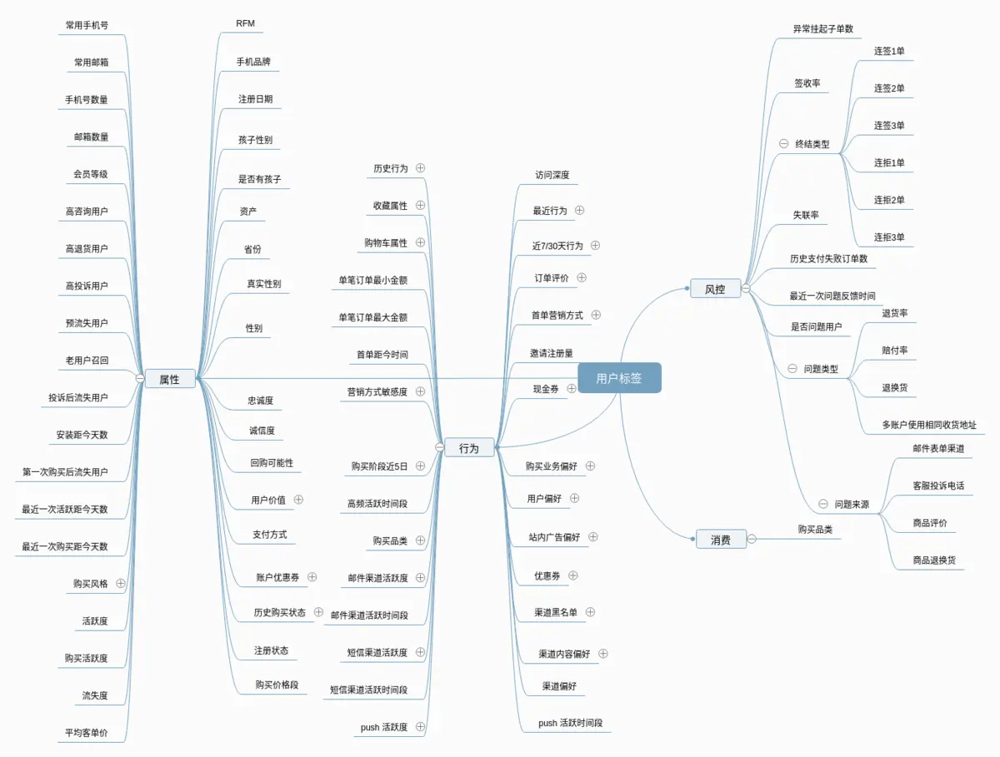


### 4. 基于模型的召回

前面我们准备好了文章画像和用户画像信息，接下来，就要开始召回阶段的工作了，可以做离线召回，也可以做在线召回，**召回算法通常包括基于内容的召回和基于协同过滤的召回**。ALS 模型是一种基于模型的协同过滤召回算法，本文将介绍如何通过 ALS 模型实现离线召回。

#### 4.1 建立召回表

- 首先，我们在 Hbase 中创建召回结果表 cb_recall，这里用不同列族来存储不同方式的召回结果，其中 als 表示模型召回，content 表示内容召回，online 表示在线召回。通过设置多个版本来存储多次召回结果，通过设置生存期来清除长时间未被使用的召回结果。

	```tsx
	create 'cb_recall', {NAME=>'als', TTL=>7776000, VERSIONS=>999999}
	alter 'cb_recall', {NAME=>'content', TTL=>7776000, VERSIONS=>999999}
	alter 'cb_recall', {NAME=>'online', TTL=>7776000, VERSIONS=>999999}
	
	# 插入样例
	put 'cb_recall', 'recall:user:5', 'als:2',[1,2,3,4,5,6,7,8,9,10]
	put 'cb_recall', 'recall:user:2', 'content:1',[45,3,5,10,289,11,65,52,109,8]
	put 'cb_recall', 'recall:user:2', 'online:2',[1,2,3,4,5,6,7,8,9,10]
	```

- 在 Hive 中建立外部表，用于离线分析

	```go
	create external table cb_recall_hbase
	(
	    user_id STRING comment "userID",
	    als     map<string, ARRAY<BIGINT>> comment "als recall",
	    content map<string, ARRAY<BIGINT>> comment "content recall",
	    online  map<string, ARRAY<BIGINT>> comment "online recall"
	)
	    COMMENT "user recall table"
	    STORED BY 'org.apache.hadoop.hive.hbase.HBaseStorageHandler'
	        WITH SERDEPROPERTIES ("hbase.columns.mapping" = ":key,als:,content:,online:")
	    TBLPROPERTIES ("hbase.table.name" = "cb_recall");
	```

- 接着，在 Hbase 中创建历史召回结果表，用于过滤已历史召回结果，避免重复推荐。这里同样设置了多个版本来存储多次历史召回结果，设置了生存期来清除很长时间以前的历史召回结果

	```tsx
	create 'history_recall', {NAME=>'channel', TTL=>7776000, VERSIONS=>999999}
	
	# 插入示例
	put 'history_recall', 'recall:user:5', 'als:1',[1,2,3]
	put 'history_recall', 'recall:user:5', 'als:1',[4,5,6,7]
	put 'history_recall', 'recall:user:5', 'als:1',[8,9,10]
	```


#### 4.2 ALS原理与模型训练

- ALS原理

	

	我们先简单了解一下 ALS 模型，上图为用户和物品的关系矩阵，其中，每一行代表一个用户，每一列代表一个物品。蓝色元素代表用户查看过该物品，灰色元素代表用户未查看过该物品，假设有 m 个用户，n 个物品，为了得到用户对物品的评分，我们可以利用矩阵分解将原本较大的稀疏矩阵拆分成两个较小的稠密矩阵，即 m x k 维的用户隐含矩阵和 k x n 维的物品隐含矩阵，如下所示：

	

	其中，用户矩阵的每一行就包括了影响用户偏好的 k 个隐含因子，物品矩阵的每一列就包括了影响物品内容的 k 个隐含因子。这里用户矩阵和物品矩阵中每个隐含因子的值就是利用交替最小二乘（Alternating Least Squares，ALS）优化算法计算而得的，所以叫做 ALS 模型。接下来，再将用户矩阵和物品矩阵相乘即可得到用户对物品的  m x n  维的评分矩阵，其中就包括每一个用户对每一个物品的评分了，进而可以根据评分进行推荐。

- ALS模型训练和预测

	Spark 已经实现了 ALS 模型，我们可以直接调用。首先，我们读取用户历史点击行为，构造训练集数据，其中只需要包括用户 ID、文章 ID 以及是否点击

	```bash
	spark.sql('use profile')
	user_article_basic = spark.sql("select user_id, article_id, clicked from user_article_basic")
	```

	`user_article_basic` 结果如下所示，其中 clicked 表示用户对文章是否发生过点击

	

	我们需要将 clicked 由 boolean 类型转成 int 类型，即 true 为 1，false 为 0

	```python
	def convert_boolean_int(row):
	    return row.user_id, row.article_id, int(row.clicked)
	
	user_article_basic = user_article_basic.rdd.map(convert_boolean_int).toDF(['user_id', 'article_id', 'clicked'])
	```

	`user_article_basic` 结果如下所示，clicked 已经是 int 类型

	

	另外，Spark 的 ALS 模型还要求输入的用户 ID 和文章 ID 必须是从 1 开始递增的连续数字，所以需要利用 Spark 的 `Pipeline` 和 `StringIndexer`，将用户 ID 和文章 ID 建立从 1 开始递增的索引

	```jsx
	from pyspark.ml.feature import StringIndexer
	from pyspark.ml import Pipeline
	
	user_indexer = StringIndexer(inputCol='user_id', outputCol='als_user_id')
	article_indexer = StringIndexer(inputCol='article_id', outputCol='als_article_id')
	pip = Pipeline(stages=[user_indexer, article_indexer])
	pip_model = pip.fit(user_article_basic)
	als_user_article = pip_model.transform(user_article_basic)
	```

	`als_user_article` 结果如下所示，als_user_id 和 als_article_id 即是 ALS 模型所需的用户索引和文章索引

	

	接下来，将用户行为数据中的 als_user_id, als_article_id, clicked 三列作为训练集，对 ALS 模型进行训练，并利用 ALS 模型计算用户对文章的偏好得分，这里可以指定为每个用户保留偏好得分最高的 K 篇文章

	```jsx
	from pyspark.ml.recommendation import ALS
	
	top_k = 100
	als = ALS(userCol='als_user_id', itemCol='als_article_id', ratingCol='clicked')
	als_model = als.fit(als_user_article)
	
	recall_res = als_model.recommendForAllUsers(top_k)
	```

	`recall_res` 结果如下所示，其中，als_user_id 为用户索引，recommendations 为每个用户的推荐列表，包括文章索引和偏好得分，如 [[255,0.1], [10,0.08], ...]

	

- ALS模型预测结果处理

	接着，我们要将推荐结果中的用户索引和文章索引还原为用户 ID 和文章 ID，这就需要建立用户 ID 与用户索引的映射及文章 ID 与文章索引的映射，可以将前面包含用户索引和文章索引的用户行为数据 `als_user_article` 分别按照 user_id 和 article_id 分组，即可得到用户 ID 与用户索引的映射以及文章 ID 与文章索引的映射

	```bash
	user_real_index = als_user_article.groupBy(['user_id']).max('als_user_id').withColumnRenamed('max(als_user_id)', 'als_user_id')
	article_real_index = als_user_article.groupBy(['article_id']).max('als_article_id').withColumnRenamed('max(als_article_id)', 'als_article_id')
	```

	`user_real_index` 结果如下所示，即用户 ID 与用户索引的映射

	

	再利用 `als_user_id` 将 `recall_res` 和 `user_real_index` 进行连接，加入用户 ID

	```csharp
	recall_res = recall_res.join(user_real_index, on=['als_user_id'], how='left').select(['als_user_id', 'recommendations', 'user_id'])
	```

	`recall_res` 结果如下所示，得到用户索引，推荐列表和用户 ID

	

	接下来，我们要构建出用户和文章的关系，利用 `explode()` 方法将 recommendations 中的每篇文章都转换为单独的一条记录，并只保留用户 ID 和文章索引这两列数据

	```csharp
	import pyspark.sql.functions as F
	
	recall_res = recall_res.withColumn('als_article_id', F.explode('recommendations')).drop('recommendations').select(['user_id', 'als_article_id'])
	```

	`recall_res` 结果如下所示，als_article_id 包括文章索引和偏好得分

	

	我们将 als_article_id 中的偏好得分去除，只保留文章索引

	```python
	def get_article_index(row):
	    return row.user_id, row.als_article_id[0]
	
	recall_res = recall_res.rdd.map(get_article_index).toDF(['user_id', 'als_article_id'])
	```

	`recall_res` 结果如下所示，得到用户 ID 和文章索引

	

	之前我们将文章 ID 和文章索引保存到了 `article_real_index`，这里利用 als_article_id 将 recall_res 和 `article_real_index` 进行连接，得到文章 ID

	```csharp
	recall_res = recall_res.join(article_real_index, on=['als_article_id'], how='left').select(['user_id', 'article_id'])
	```

	`recall_res` 结果如下所示，得到用户 ID 和要向其推荐的文章 ID

	

	

#### 4.3 推荐结果存储

为了方便查询，我们需要将推荐结果按频道分别进行存储。首先，读取文章完整信息，得到频道 ID

```bash
spark.sql('use article')
article_data = spark.sql("select article_id, channel_id from article_data")
```

利用 article_id 将 `recall_res` 和 `article_data` 进行连接，在推荐结果中加入频道 ID

```csharp
recall_res = recall_res.join(article_data, on=['article_id'], how='left')
```

`recall_res` 结果如下所示，推荐结果加入了频道 ID


将推荐结果按照 user_id 和 channel_id 进行分组，利用 `collect_list()` 方法将文章 ID 合并为文章列表

```bash
recall_res = recall_res.groupBy(['user_id', 'channel_id']).agg(F.collect_list('article_id')).withColumnRenamed('collect_list(article_id)', 'article_list')
```

`recall_res` 结果如下所示，article_list 为某用户在某频道下的推荐文章列表


最后，将推荐结果按频道分别存入召回结果表 cb_recall 及历史召回结果表 history_recall。注意，在保存新的召回结果之前需要根据历史召回结果进行过滤，防止重复推荐

```python
recall_res = recall_res.dropna()
recall_res.foreachPartition(save_offline_recall_hbase)

def save_offline_recall_hbase(partition):
    """ALS模型离线召回结果存储
    """
    import happybase
    pool = happybase.ConnectionPool(size=10, host='hadoop-master', port=9090)
    for row in partition:
        with pool.connection() as conn:
            # 读取历史召回结果表
            history_table = conn.table('history_recall')
            # 读取包含多个版本的历史召回结果
            history_article_data = history_table.cells('reco:his:{}'.format(row.user_id).encode(),
                                       'channel:{}'.format(row.channel_id).encode())

            # 合并多个版本历史召回结果
            history_article = []（比如有的用户会比较怀旧）
            if len(history_article_data) >= 2:
                for article in history_article_data[:-1]:
                    history_article.extend(eval(article))
            else:
                history_article = []

            # 过滤history_article
            recall_article = list(set(row.article_list) - set(history_article))

            if recall_article:
                table = conn.table('cb_recall')
                table.put('recall:user:{}'.format(row.user_id).encode(), {'als:{}'.format(row.channel_id).encode(): str(recall_article).encode()})
                history_table.put("reco:his:{}".format(row.user_id).encode(), {'channel:{}'.format(row.channel_id): str(recall_article).encode()})
            conn.close()
```

可以根据用户 ID 和频道 ID 来查询召回结果

```csharp
hbase(main):028:0> get 'cb_recall', 'recall:user:2'
COLUMN                     CELL                                                                        
als:13                    timestamp=1558041569201, value=[141431,14381, 17966, 17454, 14125, 161
```


### 5. 基于内容的离线及在线召回

基于模型的离线召回，属于基于协同过滤的召回算法。还有另一个经典的召回方式，那就是如何实现基于内容的离线召回。相比于协同过滤来说，基于内容的召回会简单很多，主要思路就是召回用户点击过的文章的相似文章

#### 5.1 离线召回

首先，读取用户历史行为数据，得到用户历史点击过的文章

```bash
spark.sql('use profile')
user_article_basic = spark.sql("select * from user_article_basic")
user_article_basic = user_article_basic.filter('clicked=True')
```

`user_article_basic` 结果如下所示


接下来，遍历用户历史点击过的文章，获取与之相似度最高的 K 篇文章即可。可以根据之前计算好的文章相似度表 article_similar 进行相似文章查询，接着根据历史召回结果进行过滤，防止重复推荐。最后将召回结果按照频道分别存入召回结果表及历史召回结果表

```python
user_article_basic.foreachPartition(get_clicked_similar_article)

def get_clicked_similar_article(partition):
    """召回用户点击文章的相似文章
    """
    import happybase
    pool = happybase.ConnectionPool(size=10, host='hadoop-master')
    
    with pool.connection() as conn:
        similar_table = conn.table('article_similar')
        for row in partition:
            # 读取文章相似度表,根据文章ID获取相似文章
            similar_article = similar_table.row(str(row.article_id).encode(),
                                                columns=[b'similar'])
            # 按照相似度进行排序
            similar_article_sorted = sorted(similar_article.items(), key=lambda item: item[1], reverse=True)
            if similar_article_sorted:
                # 每次行为推荐10篇文章
                similar_article_topk = [int(i[0].split(b':')[1]) for i in similar_article_sorted][:10]

                # 根据历史召回结果进行过滤
                history_table = conn.table('history_recall')
                history_article_data = history_table.cells('reco:his:{}'.format(row.user_id).encode(), 'channel:{}'.format(row.channel_id).encode())
                # 将多个版本都加入历史文章ID列表
                history_article = []
                if len(history_article_data) >= 2:
                    for article in history_article_data[:-1]:
                        history_article.extend(eval(article))
                else:
                    history_article = []

                # 过滤history_article
                recall_article = list(set(similar_article_topk) - set(history_article))

                # 存储到召回结果表及历史召回结果表
                if recall_article:
                    content_table = conn.table('cb_recall')
                    content_table.put("recall:user:{}".format(row.user_id).encode(), {'content:{}'.format(row.channel_id).encode(): str(recall_article).encode()})

                    # 放入历史召回结果表
                    history_table.put("reco:his:{}".format(row.user_id).encode(), {'channel:{}'.format(row.channel_id).encode(): str(recall_article).encode()})
```

可以根据用户 ID 和频道 ID 来查询召回结果

```csharp
hbase(main):028:0> get 'cb_recall', 'recall:user:2'
COLUMN                     CELL                                                                        
content:13                    timestamp=1558041569201, value=[141431,14381, 17966, 17454, 14125, 16174]   
```

最后，使用 Apscheduler 定时更新。在用户召回方法 `update_user_recall()` 中，增加基于内容的离线召回方法 `update_content_recall()`，首先读取用户行为日志，并筛选用户点击的文章，接着读取文章相似表，获取相似度最高的 K 篇文章，然后根据历史召回结果进行过滤，防止重复推荐，最后，按频道分别存入召回结果表及历史召回结果表

```python
def update_user_recall():
    """
    用户的频道推荐召回结果更新逻辑
    :return:
    """
    ur = UpdateRecall(500)
    ur.update_als_recall()
    ur.update_content_recall()
```

之前已经添加好了定时更新用户召回结果的任务，每隔 3 小时运行一次，这样就完成了基于内容的离线召回。

```python
from apscheduler.schedulers.blocking import BlockingScheduler
from apscheduler.executors.pool import ProcessPoolExecutor

# 创建scheduler，多进程执行
executors = {
    'default': ProcessPoolExecutor(3)
}

scheduler = BlockingScheduler(executors=executors)

# 添加一个定时运行文章画像更新的任务， 每隔1个小时运行一次
scheduler.add_job(update_article_profile, trigger='interval', hours=1)
# 添加一个定时运行用户画像更新的任务， 每隔2个小时运行一次
scheduler.add_job(update_user_profile, trigger='interval', hours=2)
# 添加一个定时运行用户召回更新的任务，每隔3小时运行一次
scheduler.add_job(update_user_recall, trigger='interval', hours=3)
# 添加一个定时运行特征中心平台的任务，每隔4小时更新一次
scheduler.add_job(update_ctr_feature, trigger='interval', hours=4)

scheduler.start()
```


#### 5.2 在线召回

前面我们实现了基于内容的离线召回，接下来我们将实现基于内容的在线召回。在线召回的实时性更好，能够根据用户的线上行为实时反馈，快速跟踪用户的偏好，也能够解决用户冷启动问题。**离线召回和在线召回唯一的不同就是，离线召回读取的是用户历史行为数据，而在线召回读取的是用户实时的行为数据，从而召回用户当前正在阅读的文章的相似文章。**

首先，我们通过 Spark Streaming 读取 Kafka 中的用户实时行为数据，Spark Streaming 配置如下

```python
from pyspark import SparkConf
from pyspark.sql import SparkSession
from pyspark import SparkContext
from pyspark.streaming import StreamingContext
from pyspark.streaming.kafka import KafkaUtils
from setting.default import DefaultConfig
import happybase

SPARK_ONLINE_CONFIG = (
        ("spark.app.name", "onlineUpdate"), 
        ("spark.master", "yarn"),
        ("spark.executor.instances", 4)
    )

KAFKA_SERVER = "192.168.19.137:9092"

# 用于读取hbase缓存结果配置
pool = happybase.ConnectionPool(size=10, host='hadoop-master', port=9090)
conf = SparkConf()
conf.setAll(SPARK_ONLINE_CONFIG)
sc = SparkContext(conf=conf)
stream_c = StreamingContext(sc, 60)

# 基于内容召回配置,用于收集用户行为
similar_kafkaParams = {"metadata.broker.list": DefaultConfig.KAFKA_SERVER, "group.id": 'similar'}
SIMILAR_DS = KafkaUtils.createDirectStream(stream_c, ['click-trace'], similar_kafkaParams)
```

Kafka 中的用户行为数据，如下所示

```json
{"actionTime":"2019-12-10 21:04:39","readTime":"","channelId":18,"param":{"action": "click", "userId": "2", "articleId": "116644", "algorithmCombine": "C2"}}
```

接下来，利用 Spark Streaming 将用户行为数据传入到 `get_similar_online_recall()` 方法中，这里利用 `json.loads()` 方法先将其转换为了 json 格式，注意用户行为数据在每条 Kafka 消息的第二个位置

```python
SIMILAR_DS.map(lambda x: json.loads(x[1])).foreachRDD(get_similar_online_recall)
```

接着，遍历用户行为数据，这里可能每次读取到多条用户行为数据。筛选出被点击、收藏或分享过的文章，并获取与其相似度最高的 K 篇文章，再根据历史召回结果表进行过滤，防止重复推荐，最后，按频道分别存入召回结果表及历史召回结果表

```python
def get_online_similar_recall(rdd):
    """
    获取在线相似文章
    :param rdd:
    :return:
    """
    import happybase

    topk = 10
    # 初始化happybase连接
    pool = happybase.ConnectionPool(size=10, host='hadoop-master', port=9090)
    for data in rdd.collect():

        # 根据用户行为筛选文章
        if data['param']['action'] in ["click", "collect", "share"]:
            with pool.connection() as conn:
                similar_table = conn.table("article_similar")

                # 根据用户行为数据涉及文章找出与之最相似文章(基于内容的相似)
                similar_article = similar_table.row(str(data["param"]["articleId"]).encode(), columns=[b"similar"])
                similar_article = sorted(similar_article.items(), key=lambda x: x[1], reverse=True)  # 按相似度排序

                if similar_article:
                    similar_article_topk = [int(i[0].split(b":")[1]) for i in similar_article[:topk]] # 选取K篇作为召回推荐结果

                    # 根据历史召回结果进行过滤
                    history_table = conn.table('history_recall')
                    history_article_data = history_table.cells(b"reco:his:%s" % data["param"]["userId"].encode(), b"channel:%d" % data["channelId"])
                    # 将多个版本都加入历史文章ID列表
                    history_article = []
                    if len(history_article_data) >1:
                        for article in history_article_data[:-1]:
                            history_article.extend(eval(article))
                    else:
                        history_article = []

                    # 过滤history_article
                    recall_article = list(set(similar_article_topk) - set(history_article))

                    # 如果有召回结果,按频道分别存入召回结果表及历史召回结果表
                    if recall_article:
                        recall_table = conn.table("cb_recall")
                        recall_table.put(b"recall:user:%s" % data["param"]["userId"].encode(), {b"online:%d" % data["channelId"]: str(recall_article).encode()})
                        history_table.put(b"reco:his:%s" % data["param"]["userId"].encode(), {b"channel:%d" % data["channelId"]: str(recall_article).encode()})

                conn.close()
```

可以根据用户 ID 和频道 ID 来查询召回结果

```csharp
hbase(main):028:0> get 'cb_recall', 'recall:user:2'
COLUMN                     CELL                                                                        
online:13                    timestamp=1558041569201, value=[141431,14381, 17966, 17454, 14125, 16174]   
```

创建 `online_update.py`，加入基于内容的在线召回逻辑

```python
if __name__ == '__main__':
    ore = OnlineRecall()
    ore.update_content_recall()
    stream_sc.start()
    _ONE_DAY_IN_SECONDS = 60 * 60 * 24
    try:
        while True:
            time.sleep(_ONE_DAY_IN_SECONDS)
    except KeyboardInterrupt:
        pass
```


### 6. 离线排序模型训练

本质就是文本点击率预估，预测得到点击率高的文章进行推荐。

**需要为排序阶段的各种排序模型做数据准备，通过特征工程将画像数据进一步加工为特征数据，以供排序模型直接使用。**

我们可以将特征数据存储到 Hbase 中，这里我们先在 Hbase 中创建好 ctr_feature_article 表 和 ctr_feature_user 表，分别存储文章特征数据和用户特征数据

```sql
-- 文章特征表
create 'ctr_feature_article', 'article'
-- 如 article:13401 timestamp=1555635749357, value=[18.0,0.08196639249252607,0.11217275332895373,0.1353835167902181,0.16086650318453152,0.16356418791892943,0.16740082750337945,0.18091837445730974,0.1907214431716628,0.2........................-0.04634634410271921,-0.06451843378804649,-0.021564142420785692,0.10212902152136256]

-- 用户特征表
create 'ctr_feature_user', 'channel'
-- 如 4 column=channel:13, timestamp=1555647172980, value=[]
```


#### 6.1 构建文章特征

文章特征包括文章关键词权重、文章频道以及文章向量，我们首先读取文章画像

```bash
spark.sql("use article")
article_profile = spark.sql("select * from article_profile")
```

在文章画像中筛选出权重最高的 K 个关键词的权重，作为文章关键词的权重向量

```python
def article_profile_to_feature(row):
    try:
        article_weights = sorted(row.keywords.values())[:10]
    except Exception as e:
        article_weights = [0.0] * 10
    return row.article_id, row.channel_id, article_weights
article_profile = article_profile.rdd.map(article_profile_to_feature).toDF(['article_id', 'channel_id', 'weights'])
```

`article_profile` 结果如下所示，weights 即为文章关键词的权重向量


接下来，读取文章向量信息，再将频道 ID 和文章向量加入进来，利用 article_id 将 article_profile 和 article_vector 进行内连接，并将 weights 和 articlevector 转为 `vector` 类型

```python
article_vector = spark.sql("select * from article_vector")
article_feature = article_profile.join(article_vector, on=['article_id'], how='inner')

def feature_to_vector(row):

    from pyspark.ml.linalg import Vectors

    return row.article_id, row.channel_id, Vectors.dense(row.weights), Vectors.dense(row.articlevector)

article_feature = article_feature.rdd.map(feature_to_vector).toDF(['article_id', 'channel_id', 'weights', 'articlevector'])
```

最后，我们将 channel_id, weights, articlevector 合并为一列 features 即可（通常 channel_id 可以进行 one-hot 编码，我们这里先省略了）

```jsx
from pyspark.ml.feature import VectorAssembler

columns = ['article_id', 'channel_id', 'weights', 'articlevector']
article_feature = VectorAssembler().setInputCols(columns[1:4]).setOutputCol("features").transform(article_feature)
```

`article_feature` 结果如下所示，features 就是我们准备好的文章特征


最后，将文章特征结果保存到 Hbase 中

```python
def save_article_feature_to_hbase(partition):
    import happybase
    pool = happybase.ConnectionPool(size=10, host='hadoop-master')
    with pool.connection() as conn:
        table = conn.table('ctr_feature_article')
        for row in partition:
            table.put('{}'.format(row.article_id).encode(),
                     {'article:{}'.format(row.article_id).encode(): str(row.features).encode()})

article_feature.foreachPartition(save_article_feature_to_hbase)
```


#### 6.2 构建用户特征

由于用户在不同频道的偏好差异较大，所以我们要计算用户在每个频道的特征。首先读取用户画像，将空值列删除

```bash
spark.sql("use profile")

user_profile_hbase = spark.sql("select user_id, information.birthday, information.gender, article_partial, env from user_profile_hbase")
```

`user_profile_hbase` 结果如下所示，其中 article_partial 为用户标签及权重，如 (['18:vars': 0.2, '18: python':0.2, ...], ['19:java': 0.2, '19: javascript':0.2, ...], ...) 表示某个用户在 18 号频道的标签包括 var、python 等，在 19 号频道的标签包括 java、javascript等。


由于 gender 和 birthday 两列空值较多，我们将这两列去除（实际场景中也可以根据数据情况选择填充）

```bash
# 去除空值列
user_profile_hbase = user_profile_hbase.drop('env', 'birthday', 'gender')
```

提取用户 ID，获取 user_id 列的内容中 `:` 后面的数值即为用户 ID

```python
def get_user_id(row):
    return int(row.user_id.split(":")[1]), row.article_partial

user_profile_hbase = user_profile_hbase.rdd.map(get_user_id)
```

将 `user_profile_hbase` 转为 DataFrame 类型

```jsx
from pyspark.sql.types import *

_schema = StructType([
    StructField("user_id", LongType()),
    StructField("weights", MapType(StringType(), DoubleType()))
])

user_profile_hbase = spark.createDataFrame(user_profile_hbase, schema=_schema)
```

接着，将每个频道内权重最高的 K 个标签的权重作为用户标签权重向量

```python
def frature_preprocess(row):

    from pyspark.ml.linalg import Vectors

    user_weights = []
    for i in range(1, 26):
        try:
            channel_weights = sorted([row.weights[key] for key in row.weights.keys() if key.split(':')[0] == str(i)])[:10]
            user_weights.append(channel_weights)
        except:
            user_weights.append([0.0] * 10)
    return row.user_id, user_weights

user_features = user_profile_hbase.rdd.map(frature_preprocess).collect()
```

`user_features` 就是我们计算好的用户特征，数据结构类似 (10, [[0.2, 2.1, ...], [0.2, 2.1, ...]], ...)，其中元组第一个元素 10 即为用户 ID，第二个元素是长度为 25 的用户频道标签权重列表，列表中每个元素是长度为 K 的用户标签权重列表，代表用户在某个频道下的标签权重向量。

最后，将用户特征结果保存到 Hbase，利用 Spark 的 `batch()` 方法，按频道批量存储用户特征

```python
import happybase

# 批量插入Hbase数据库中
pool = happybase.ConnectionPool(size=10, host='hadoop-master', port=9090)
with pool.connection() as conn:
    ctr_feature = conn.table('ctr_feature_user')
    with ctr_feature.batch(transaction=True) as b:
        for i in range(len(user_features)):
            for j in range(25):
                b.put("{}".format(res[i][0]).encode(),{"channel:{}".format(j+1).encode(): str(res[i][1][j]).encode()})
    conn.close()
```


#### 6.3 基于LR模型的离线排序

排序流程包括离线排序和在线排序：

- 离线排序
	 读取前天（第 T - 2 天）之前的用户行为数据作为训练集，对离线模型进行训练；训练完成后，读取昨天（第 T - 1 天）的用户行为数据作为验证集进行预测，根据预测结果对离线模型进行评估；若评估通过，当天（第 T 天）即可将离线模型更新到定时任务中，定时执行预测任务；明天（第 T + 1 天）就能根据今天的用户行为数据来观察更新后离线模型的预测效果。（注意：数据生产有一天时间差，第 T 天生成第 T - 1 天的数据）
- 在线排序
	 读取前天（第 T - 2 天）之前的用户行为数据作为训练集，对在线模型进行训练；训练完成后，读取昨天（第 T - 1 天）的用户行为数据作为验证集进行预测，根据预测结果对在线模型进行评估；若评估通过，当天（第 T 天）即可将在线模型更新到线上，实时执行排序任务；明天（第 T + 1 天）就能根据今天的用户行为数据来观察更新后在线模型的预测效果。

利用排序模型可以进行评分预测和用户行为预测，通常推荐系统利用排序模型进行用户行为预测，比如点击率（CTR）预估，进而根据点击率对物品进行排序，目前工业界常用的点击率预估模型有如下 3 种类型：

- 宽模型 + 特征⼯程
	 LR / MLR + 非 ID 类特征（⼈⼯离散 / GBDT / FM），可以使用 Spark 进行训练
- 宽模型 + 深模型
	 Wide&Deep，DeepFM，可以使用 TensorFlow 进行训练
- 深模型：
	 DNN + 特征 Embedding，可以使用 TensorFlow 进行训练

这里的宽模型即指线性模型，线性模型的优点包括：

- 相对简单，训练和预测的计算复杂度都相对较低
- 可以集中精力发掘新的有效特征，且可以并行化工作
- 解释性较好，可以根据特征权重做解释

本文我们将采用逻辑回归作为离线模型，进行点击率预估。逻辑回归（Logistic Regression，LR）是基础的二分类模型，也是监督学习的一种，通过对有标签的训练集数据进行特征学习，进而可以对测试集（新数据）的标签进行预测。我们这里的标签就是指用户是否对文章发生了点击行为。


- 合并上述文章特征和用户特征，得到**channel_id1个+用户特征权重10个+文章向量100个+文章关键词权重 = 121个特征**。如下图所示：

	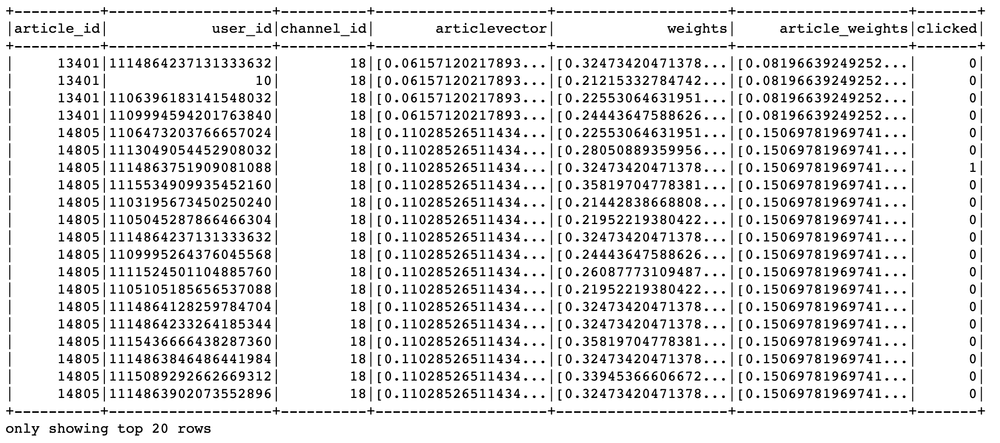

- 模型训练

	Spark 已经实现好了 LR 模型，通过指定训练集 train 的特征列 features 和标签列 clicked，即可对 LR 模型进行训练，再将训练好的模型保存到 HDFS

	

	```jsx
	from pyspark.ml.feature import VectorAssembler
	from pyspark.ml.classification import LogisticRegression
	
	lr = LogisticRegression()
	model = lr.setLabelCol("clicked").setFeaturesCol("features").fit(train)
	model.save("hdfs://hadoop-master:9000/headlines/models/lr.obj")
	```

	加载训练好的 LR 模型，调用 `transform()` 对训练集做出预测（实际场景应该对验证集和训练集进行预测）

	

	```jsx
	from pyspark.ml.classification import LogisticRegressionModel
	
	online_model = LogisticRegressionModel.load("hdfs://hadoop-master:9000/headlines/models/lr.obj")
	sort_res = online_model.transform(train)
	```

	预测结果 `sort_res` 中包括 clicked 和 probability 列，其中 clicked 为样本标签的真实值，probability 是包含两个元素的列表，第一个元素是预测的不点击概率，第二个元素则是预测的点击概率，可以提取点击率（CTR）

	

	```python
	def get_ctr(row):
	    return float(row.clicked), float(row.probability[1]) 
	
	score_label = sort_res.select(["clicked", "probability"]).rdd.map(get_ctr)
	```


- 模型评估

	离线模型评估指标包括：

	- 评分准确度
		 通常是均方根误差（RMSE），用来评估预测评分的效果
	- 排序能力
		 通常采用 [AUC（Area Under the Curve）](https://mp.weixin.qq.com/s/3YJnUbvPDqshpnQOL2O1_g)，即 ROC 曲线下方的面积
	- 分类准确率（Precision）
		 表示在 Top K 推荐列表中，用户真实点击的物品所占的比例
	- 分类召回率（Recall）
		 表示在用户真实点击的物品中，出现在 Top K 推荐列表中所占的比例

	当模型更新后，还可以根据商业指标进行评估，比例类的包括： 点击率（CTR）、转化率（CVR），绝对类的包括：社交关系数量、用户停留时长、成交总额（GMV）等。

	推荐系统的广度评估指标包括：

	- 覆盖率
		 表示被有效推荐（推荐列表长度大于 c）的用户占全站用户的比例，公式如下：
		 
	- 失效率
		 表示被无效推荐（推荐列表长度为 0）的用户占全站用户的比例，公式如下：
		 
	- 新颖性
	- 更新率
		 表示推荐列表的变化程度，当前周期与上个周期相比，推荐列表中不同物品的比例
		 

	推荐系统的健康评估指标包括：

	- 个性化
		 用于衡量推荐的个性化程度，是否大部分用户只消费小部分物品，可以计算所有用户推荐列表的平均相似度
	- 基尼系数
		 用于衡量推荐系统的马太效应，反向衡量推荐的个性化程度。将物品按照累计推荐次数排序，排序位置为 i，推荐次数占总推荐次数的比例为 ，推荐次数越不平均，基尼系数越接近 1，公式为：
		 )
	- 多样性
		 通常是在类别维度上衡量推荐结果的多样性，可以衡量各个类别在推荐时的熵
		 %7D%7Bn%5Clog(n)%7D)
		 其中，物品共包括 n 个类别，类别 i 被推荐次数占总推荐次数的比例为 ，分母是各个类别最均匀时对应的熵，分子是实际推荐结果的类别分布熵。这是整体推荐的多样性，还可以计算每次推荐和每个用户推荐的多样性。

	我们这里主要根据 AUC 进行评估，首先利用 `model.summary.roc` 绘制 ROC 曲线

	```csharp
	import matplotlib.pyplot as plt
	
	plt.figure(figsize=(5,5))
	plt.plot([0, 1], [0, 1], 'r--')
	plt.plot(model.summary.roc.select('FPR').collect(),
	         model.summary.roc.select('TPR').collect())
	plt.xlabel('FPR')
	plt.ylabel('TPR')
	plt.show()
	```

	ROC 曲线如下所示，曲线下面的面积即为 AUC（Area Under the Curve），AUC 值越大，排序效果越好

	

	利用 Spark 的 `BinaryClassificationMetrics()` 计算 AUC

	```jsx
	from pyspark.mllib.evaluation import BinaryClassificationMetrics
	
	metrics = BinaryClassificationMetrics(score_label)
	metrics.areaUnderROC
	```

	也可以利用 sklearn 的 `roc_auc_score()` 计算 AUC，`accuracy_score()` 计算准确率

	```python
	from sklearn.metrics import accuracy_score, roc_auc_score,
	import numpy as np
	
	arr = np.array(score_label.collect())
	# AUC
	roc_auc_score(arr[:, 0], arr[:, 1]) # 0.719274521004087
	
	# 准确率
	accuracy_score(arr[:, 0], arr[:, 1].round()) # 0.9051438053097345
	```